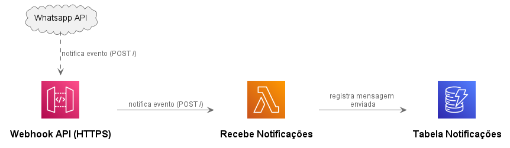

* [Link do trabalho escrito](https://docs.google.com/document/d/1bquCJP7uByfDZpwk15hdc4j71CppWJYqiqzT81oj63Y/edit?usp=sharing)
* [Link amplify libraries](https://docs.amplify.aws/lib/q/platform/js)
https://github.com/simalexan/s3-lambda-transcribe-audio-to-text-s3/blob/master/template.yml

Desenvolvimento do aplicativo para ajudar uma empresa na gestão de relacionamento com seus clientes frente às novas tendências de comunicação que envolvem novas tecnologias externas ao seu controle, considerando necessidades específicas do negócio da empresa e cumprimento das legilasções existentes.

## Rascunho

Tarefas voltadas para o TCC:
- Utilização e análise da arquitetura de desenvolvimento orientada a eventos (serverless) da AWS verificando e observando sua capacidade de adaptação, modularização e reaproveitamento em projetos com necessidades distintas. A grosso termo, verificar se esta arquitetura auxilia na reutilização, implementando e integrações com ferramentas externas, permitindo a escrita em módulos a fim de adaptar um solução à necessidades específicas;
- Levantamento de requisitos essenciais presentes em legislações;
- Descrição da arquitetura serverless da AWS;

## Utilização de histórias do usuário 

[Guia do Scrum](https://scrumguides.org/docs/scrumguide/v2020/2020-Scrum-Guide-PortugueseBR-3.0.pdf)

Conforme o guia do scrum:
"Scrum é baseado no empirismo e lean thinking. O empirismo afirma que o conhecimento vem da experiência e da tomada de decisões com base no que é observado. O lean thinking reduz o desperdício e se concentra no essencial.
Scrum combina quatro eventos formais para inspeção e adaptação, contidos dentro de um evento, a Sprint. Esses eventos funcionam porque implementam os pilares empíricos do Scrum: transparência, inspeção e adaptação."

Nesta perspectiva, temos no Scrum a utilização das histórias do usuário, um artefato que evidencia o empirismo ao transcrever os requisitos de forma a provocar a observação dos processos como origem do conhecimento. Deste pressuposto, esta prática e outras da framework Scrum é bem vista ao considerarmos os bons resultados amplamente defendidos no meio acadêmico e profissional. 

## Função de ferramentas meio à processos e pessoas.

As pessoas resolvem os problemas. O processo é a forma, sequência de tarefas executadas a fim de resolver os problemas. Já as ferramentas, auxiliam as pessoas na resolução dos problemas. Logo, dado um processo específico, a ferramenta pode ser utilizada na facilitação da captação de dados para geração de informação (base analítica), e consequente auxílio das pessoas quanto à inspeção dos processos, adaptação e base para tomada de decisão, dentro do processo de solução de problemas, de forma mais eficiente. Ainda, as ferramentas auxiliam a tornar explícitos alguns eventos que podem não se apresentar às pessoas de forma clara ou temporal, como por exemplo eventos relacionados ao tempo, como prazo para entrega, que é dinâmico, ou ainda eventos originários de plataformas com monitoramento ineficiente.

Dessa forma, trazendo para o caso de uso em questão (CRM), busca-se uma simplificação do monitoramento de plataforma externa dentro do processo de gerenciamento do relacionamento com o cliente. Por plataforma externas, temos canais de atendimento como o whatsapp, e redes sociais como facebook e whatsapp. 
 
## História do usuário

(Genérico)
John Doe deseja entrar na aplicação e após sua autenticação é desejavel uma visualização das interações (ou novas mensagems em interações não concluidas) iniciadas pelos clientes nos últimos dias, sejam elas pela plataforma de controle da empresa, ou ainda interações no whatsapp ou instagram. Ainda, seria de grande valia, nesta tela, um gráfico contabilizando a quantidade de interações em aberto à um dia, à dois dias, à três e assim adiante. 

Neste contexo, a ferramenta deve apresentar recurso para filtrar as interações em aberto por quantidade de dias em que a interação se encontra em aberto. 

Desejam que, depois de selecionar um cliente, na interface seguinte seja possível ler as mensgens encaminhadas pelos clientes, sejam elas advindas da plataforma whatsapp, do canal de atendimento disponibilizado por site, ou ainda de plataformas de interação como o instagram, assim possibilitando um entendimento cronológico das interações do cliente. 

Para análise semanal ou mensal, já em outra tela, gráficos mensurando o tempo médio de atendimento comparando períodos recentes com períodos históricos de forma a possibilitar identificar problemas/dificuldades e possibilitar a adaptação.

Outros atendentes além de John Doe também realizarão interações com os clientes, de forma que é ideal registrar quais interações são de cada atendente, mesmo que não seja essencial a visualização de gráficos relacionado com a quantidade de interações por atendente, isto visto que proatividade e motivação dos atendentes não é uma problemática na empresa. Contudo, a garantia da qualidade no atendimento é um dos princípios base da empresa, neste sentido, gráficos que quantificam dados de análise de sentimentos por inteligência artificial seriam de alto valor.

Tendo em vista que a atenção dos atendentes não é exclusiva a responder usuários e estende a, por exemplo, buscar a solução de alguns problemas que eventualmente surjam, é ideal a existência de uma forma de notificação de novas mensagens em interações com as quais um atendente tenha iniciado uma interação, essa notificação poderia ser feita por aplicação mobile, o que permitiria ainda resposta rápida, reduzindo assim o tempo de resposta às interações dos usuários.

(Específico)
Ainda, por se tratar de uma empresa de design gráfico, levando em conta a grande troca de mídias nas interações, por exemplo imagens, uma interface web para gerenciamento destas mídias, bem como dos arquivos digitais de trabalho (ex. AI, SVG e PSD), possibilita a estruturação de sistemas de busca de trabalhos anteriores o que agilizaria o trabalhos dos designers. Os principais parâmetros atualmente utilizados para a busca nos diretórios são trabalhos anteriores do cliente em atendimento, trabalhos relacionados a um tema de arte, ou ainda artes utilizadas para a personalização de um tipo de produto. A geração de valor seria substancial visto que atualmente a busca é iniciada principalmente buscando na memória, por exemplo, o design lembra que já realizou um trabalho com aquele tema para um cliente específico. A busca por nome do cliente se dá atualmente pela estrutura de pasta.

Outra dificuldade apresentada é a busca de especificações passadas pelos clientes por meio de audio, a funcionalidade de conversão audio para texto é tida com bons olhos pelos atendentes.


### Desenvolvimento

A partir das histórias do usuário é possível indentificarmos os padrões de consultas pretendidos pelos usuários da aplicação. Conhecermos estes padrões é o primeiro passo para podermos modelarmos como serão guardados os dados. Em banco de dados não relacional buscamos definir a forma como os dados serão salvos para otmizarmos as operações realizadas pela aplicação, ou seja, otmizar os registros e as buscas realizadas pelos clientes na aplicação, considerando os filtros que serão utilizados, formato dos dados quando do registro e formato dos resultados quando necessários para leitura.

Conforme o [quia de desenvolvimento do DynamoDB](https://docs.aws.amazon.com/amazondynamodb/latest/developerguide/bp-general-nosql-design.html), é importante conhecermos três propriedades fundamentais do padrão de acesso da aplicação, o tamanho dos dados, o formato e a velocidade. Isto porque, ao utilizarmos o DynamoDB, os dados serão particionados em diferentes recursos computacionais, e a forma com que a aplicação é utilizada sujere a melhor forma de particionar estes dados para que possamos otimizar as operações. 

Ainda temos que considerar a troca de dados com outros sistemas que serão clientes da aplicação. Podemos ver, no seguinte trecho da história do usuário, que parte dos dados serão encaminhadas por outros sistemas, mesmo tendo sido originárias de outras pessoas, isto porque, do ponto de vista da aplicação do caso de uso, os clientes da aplicação serão principalmente os atendentes e as aplicações externas (ex. whatsapp). Vejamos:

> John Doe deseja entrar na aplicação e após sua autenticação é desejavel uma visualização das interações (ou novas mensagems em interações não concluidas) iniciadas pelos clientes nos últimos dias, sejam elas pela plataforma de controle da empresa, ou ainda interações no whatsapp ou instagram.

Pela história do usuário identificamos qual busca será necessário à aplicação para apresentar os dados para John Doe. Por outro lado, a forma de transmissão dos dados de plataforma externa, aqui especificamente para o whatsapp, é dada na [documentação da api do whatsapp disponibilizada pela Meta](https://developers.facebook.com/docs/whatsapp/cloud-api/webhooks/). Conforme documentação da Meta, para recebermos notificações de mensagens e status é necessário um webhook que receba requisições POST pelo protocolo HTTPS, o que pode ser realizado dentro da arquitetura disponibilizada pela AWS, utilizando os componentes serverless conforme diagrama abaixo:



Os dados encaminhados no formato JSON ao Webhook seguem uma estrutura padrão conforme imagem abaixo, e os dados presentes nela variam conforme o tipo de mensagem ou notificação de status. Contudo, é comum a presensa dos atributos que identificam a pessoa de origem, a pessoa de destino, identificador da mensagem relacionada e o tempo (data hora) do evento:

```json
{
  "object": "whatsapp_business_account",
  "entry": [
        {
            "id": "WHATSAPP_BUSINESS_ACCOUNT_ID",
            "changes": [
                {
                    "value": {
                        "messaging_product": "whatsapp",
                        "metadata": {
                            "display_phone_number": "PHONE_NUMBER",
                            "phone_number_id": "PHONE_NUMBER_ID"
                        },
                        # specific Webhooks payload 
                    },
                    "field": "messages"
                }
            ]
        }
    ]
}
```

https://docs.google.com/spreadsheets/d/1ltloQ22h7bj-y_gCXj94Dl4aoLouR1N9LuHAlc5Nu7M/edit#gid=0

Tabela de mensagens:

| Primary Key   |                           | Data Attributes   |
| :------------ | :------------------------ | :---------------- |
| Partition Key | Sort Key                  | Others attributes |
| 5531920079592 | message-1681593444-gffgfs |                   |
| 5531920079592 | message-1681592364-xkjeo  |                   |


Tabela de atendimentos

| Primary Key   |                   | Data Attributes |         |             |     |             |            |          |            |       |        |
| :------------ | :---------------- | :-------------- | :------ | :---------- | :-- | :---------- | :--------- | :------- | :--------- | :---- | :----- |
| Partition Key | Sort Key          | Attribute 1     |         | Attribute 2 |     | Attribute 3 |            |          |            |       |        |
| 5531920079592 | ticket-1681592364 | AttendentId     | fdsfdsa | Unreaded:   | 2   | CreatedAt:  | 1681592364 |          |            | Open: | "OPEN" |
| 5531920079592 | ticket-1681592164 | AttendentId     | fdsfdsa | Unreaded:   | 0   | CreatedAt:  | 1681592164 | ClosedAt | 1681592264 |       |        |

