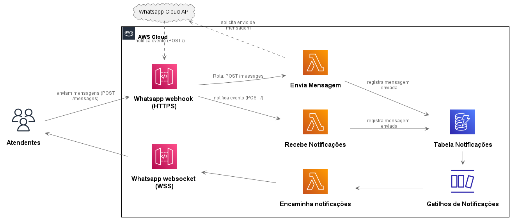

# Arquitetura do whatsapp webhook

O objetivo em criar uma interface com o whatsapp é poder ficar mais próximo ao cliente. O whatsapp vem se mostrando o canal de atendimento preferido de muitos clientes, e também é uma escolha dos pequenos comerciantes visto que ao iniciar um negócio não é comum criar um website próprio para o atendimento. Outra opção para o pequeno negócio que ainda não tem o próprio aplicativo de atendimento é o e-mail, contudo, para o cliente. acessar o e-mail para enviar uma mensagem, ou até mesmo abrir um site de atendimento, nem sempre é tão conveniente quanto abrir o whatsapp, aplicativo comum nos celulares, e enviar a mensagem. A idéia principal é levar o atendimento mais próximo ao cliente.

Contudo, conforme o pequeno negócio se torna de tamanho médio, alguns dificuldades podem surgir quando utilizando do whatsapp bussines, por exemplo a necessidade de dois atendentes, necessidade analítica dos atendimentos (ex. calculo de tempo de resposta), relacionar pedidos, dentre outras dificuldades.

https://datasebrae.com.br/total-de-empresas-brasileiras-11-03-2020/